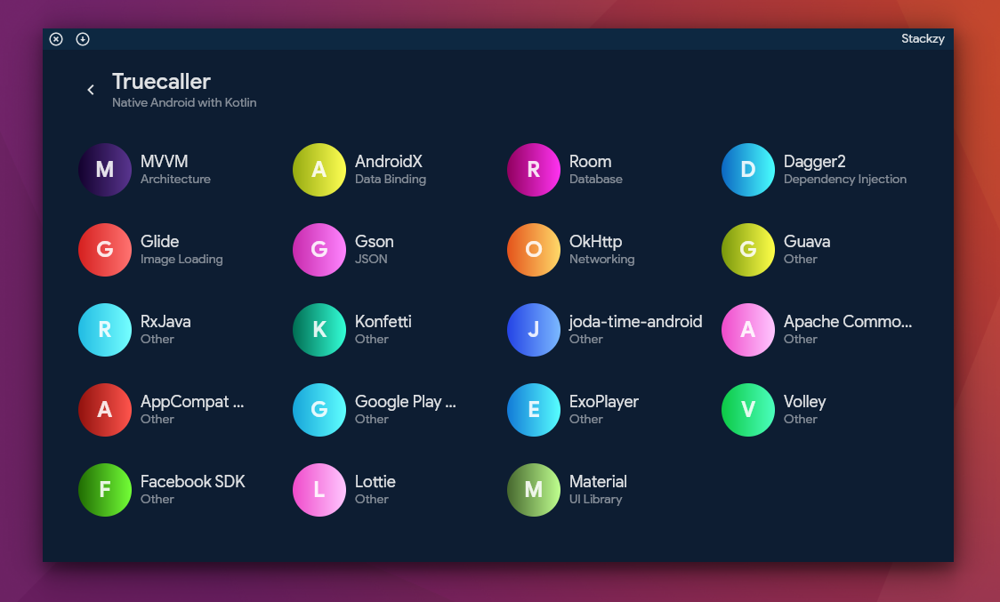

# stackzy



👷 This project is under active development.

[comment]: <> (![latestVersion]&#40;https://img.shields.io/github/v/release/theapache64/stackzy&#41;)
<a href="https://twitter.com/theapache64" target="_blank">

</a>

> A desktop app to identify the app stack. Built using Compose desktop

### ✨ Demo

- [Watch](https://www.youtube.com/watch?v=HjHQGcKxXaM&ab_channel=theapache64) demo

## ⌨️ Usage

1. Open `Stackzy`
1. Choose `Device`
1. Choose `Application` to perform the analysis
1. Enjoy the report 😎

## 💻 Install

- Executables for windows, linux and mac will be released soon. 😇

## 🏋 Dependency

- JDK

## 🏗️️ Built with

| What            | How                        |
|----------------	|------------------------------	|
| 🎭 User Interface    | [Compose Desktop](https://github.com/jetbrains/compose-jb)                |
| 🏗 Architecture    | [MVVM](https://en.wikipedia.org/wiki/Model%E2%80%93view%E2%80%93viewmodel)                            |
| 🧠 Backend    | [Retrosheet](https://github.com/theapache64/retrosheet)                            |
| 💉 DI                | [Dagger2](https://github.com/google/dagger)                        |
| 🛠️ APK Decompiling                | [ApkTool](https://github.com/iBotPeaches/Apktool)                        |
| 🛣️ Navigation        | [Decompose](https://github.com/arkivanov/Decompose)                        |
| 🌊 Async            | [Coroutines](https://kotlinlang.org/docs/coroutines-overview.html) + [Flow](https://kotlin.github.io/kotlinx.coroutines/kotlinx-coroutines-core/kotlinx.coroutines.flow/-flow/)                |
| 🌐 Networking        | [Retrofit](https://github.com/square/retrofit)                        |
| 📄 JSON            | [Moshi](https://github.com/square/moshi)                            |
| ⌨️ Logging            | [Arbor](https://github.com/ToxicBakery/Arbor)                            |
| 💻 ADB            | [Adam](https://malinskiy.github.io/adam/)                            |
| 🧪 Testing            | [DaggerMock](https://github.com/fabioCollini/DaggerMock) + [JUnit](https://github.com/junit-team/junit5)    |

## 🙇 Credits

- Special thanks to [@mikepenz](https://github.com/mikepenz) for contributing 200+ libraries from his
  project [AboutLibraries](https://github.com/mikepenz/AboutLibraries) 📚
- Special thanks to [@SpikeySanju](https://github.com/Spikeysanju) for the beautiful design 😎
- Icons are from [flaticon.com](https://www.flaticon.com/)
- Illustrations are from [evernote.design](https://evernote.design/categories/illustrations/)

## 🥼 Test

Before executing any test, ensure

- A device has connected to the adb

## ✍️ Authors

👤 **theapache64**

* Twitter: <a href="https://twitter.com/theapache64" target="_blank">@theapache64</a>
* Email: theapache64@gmail.com

👤 **mikepenz**

* Twitter: <a href="https://twitter.com/mike_penz" target="_blank">@mike_penz</a>
* Email: mikepenz@gmail.com

Feel free to ping us 😉

## 🤝 Contributing

Contributions are what make the open source community such an amazing place to be learn, inspire, and create. Any
contributions you make are **greatly appreciated**.

1. Open an issue first to discuss what you would like to change.
1. Fork the Project
1. Create your feature branch (`git checkout -b feature/1/amazing-feature`)
1. Commit your changes (`git commit -m 'Add some amazing feature'`)
1. Push to the branch (`git push origin feature/1/amazing-feature`)
1. Open a pull request

(Here, `1` = issue number)

Please make sure to update tests as appropriate.

## ❤ Show your support

Give a ⭐️ if this project helped you!

<a href="https://www.patreon.com/theapache64">
  
</a>

<a href="https://www.buymeacoffee.com/theapache64" target="_blank">
    
</a>

<a href="https://www.paypal.me/theapache64" target="_blank">
    
</a>

## ☑️ TODO

- [ ] Release the first public version with basic features
- [ ] Theme switching
- [ ] Playstore integration (Download APK from playstore)
- [ ] Support more libraries

## 📝 License

- [Fira Code](https://github.com/tonsky/FiraCode) : [OFL-1.1 Licence](https://github.com/tonsky/FiraCode/blob/master/LICENSE)

```
Copyright © 2021 - theapache64

Licensed under the Apache License, Version 2.0 (the "License");
you may not use this file except in compliance with the License.
You may obtain a copy of the License at

   http://www.apache.org/licenses/LICENSE-2.0

Unless required by applicable law or agreed to in writing, software
distributed under the License is distributed on an "AS IS" BASIS,
WITHOUT WARRANTIES OR CONDITIONS OF ANY KIND, either express or implied.
See the License for the specific language governing permissions and
limitations under the License.
```

_This README was generated by [readgen](https://github.com/theapache64/readgen)_ ❤
